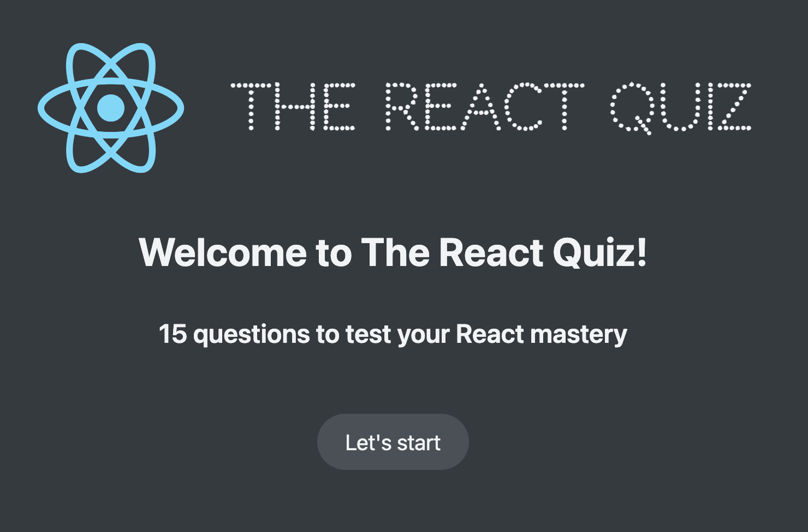
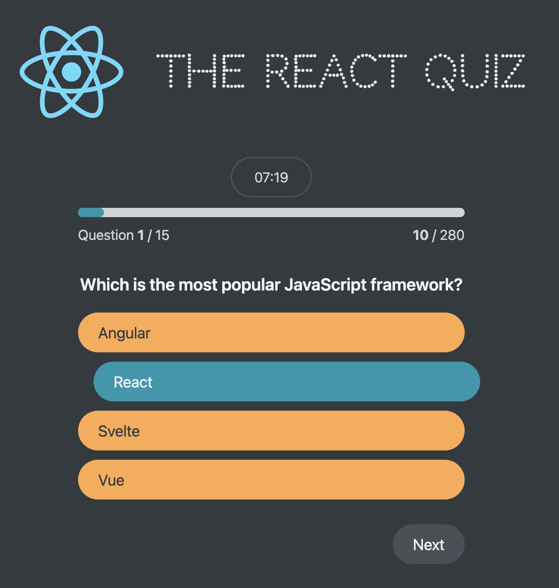
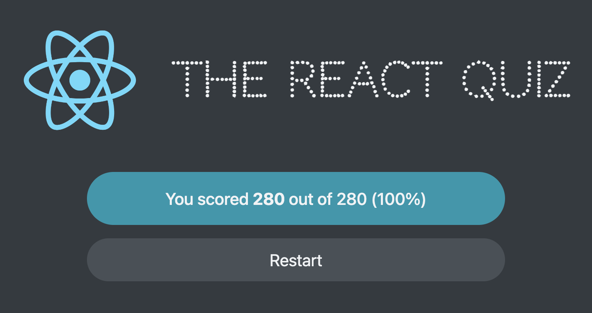

# The React Quiz App





<br/>

This interactive React Quiz App is designed to challenge your knowledge of the React framework. Whether you're a seasoned developer or just starting out, this quiz will test your understanding of key concepts, syntax, and best practices.

## Getting Started with Create React App

## Installation

### Clone the repository

```bash
  git clone https://github.com/Vitalii-Plechak/the-react-quiz.git
```

## Available Scripts

In the project directory, you can run:

### `npm install`

This command will install the React Quiz App.

### `npm run dev:start`

Runs the app in the development mode.\
Open [http://localhost:3001](http://localhost:3001) to view it in your browser.

The page will reload when you make changes.\
You may also see any lint errors in the console.

### `npm run dev:stop`

Run this command to stop the application and json-server. It will kill any process on ports 3001 and 9001.

### `server:start and server:stop`

These command help to start or stop json-server separately from the main app. It will kill only 9001 port.\
Open [http://localhost:9001](http://localhost:9001) to view it in your browser.
